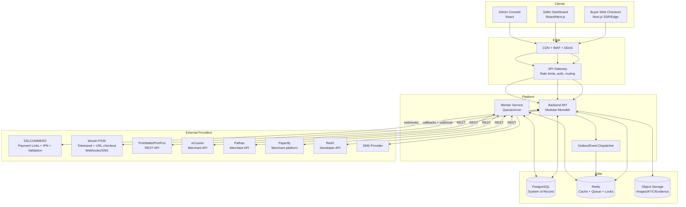
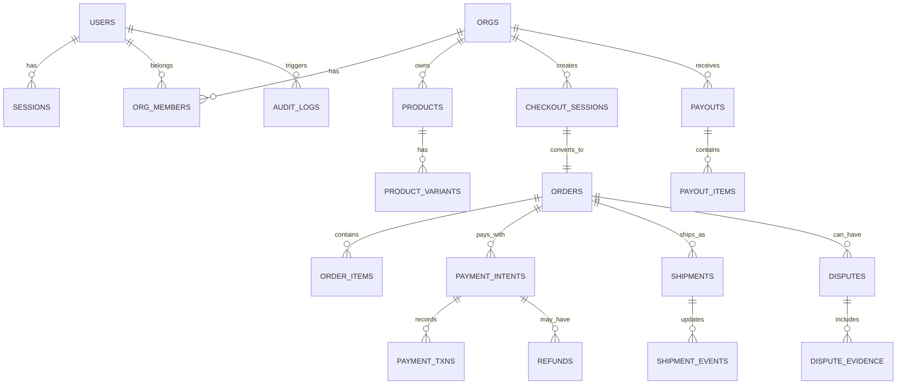
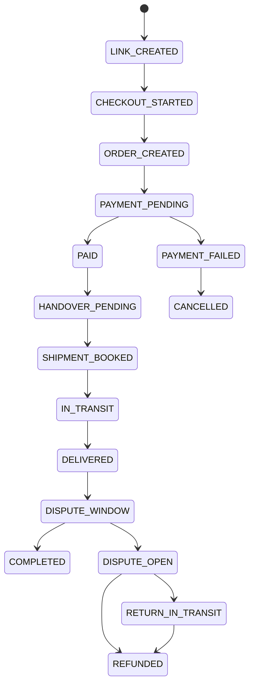
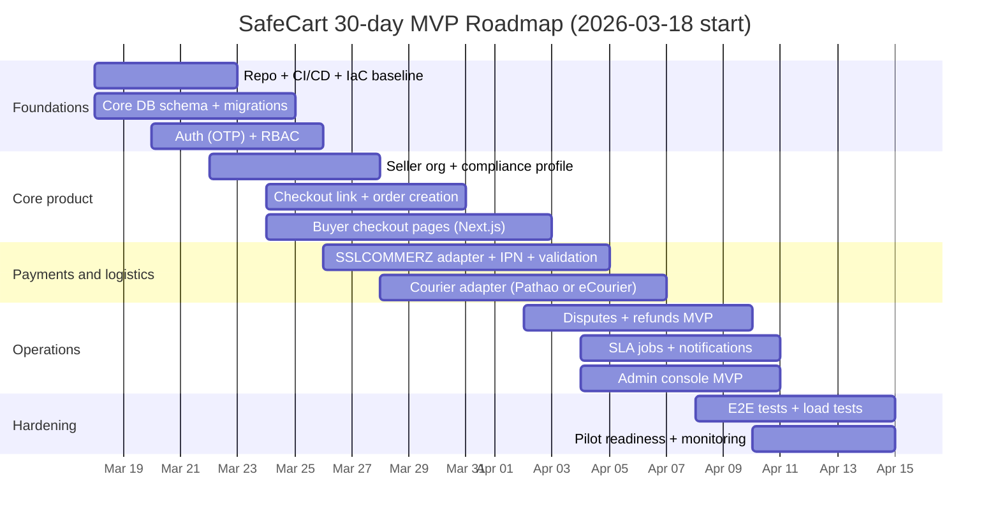

# SafeCart Production SRS and Implementation Plan for Bangladesh F-commerce

## Executive summary

SafeCart is a **checkout + escrow-orchestration + courier-booking** platform built specifically to standardize and “de-risk” transactions that currently happen informally via Facebook chat in Bangladesh. The product creates a **shareable checkout link** (paste into Messenger/WhatsApp) that captures buyer address + terms, initiates a payment (card/MFS), books a courier pickup, tracks delivery, and enforces a dispute/refund workflow with strong auditability.

This product is viable in Bangladesh because the official **Digital Commerce Operation Guidelines 2021** (gazetted) explicitly require: clear disclosure and terms, cookie notice, explicit consent for collecting personal data, transaction record retention, delivery timelines (including handover to courier within 48 hours after full payment), complaint handling (including a 72-hour resolution expectation), and rules about advance payment and refunds; the same guidelines also explicitly allow using **Bangladesh Bank–approved “escrow service”** for digital commerce transactions. citeturn3view3turn3view4turn3view5turn3view6turn3view7

Market reach is large: industry reporting estimates **500,000 to 1,000,000 entrepreneur-focused Facebook pages** in Bangladesh and **200,000 to 250,000 active Facebook commerce page entrepreneurs**. citeturn6search2 Separately, DataReportal’s most recent Bangladesh report shows Facebook’s advertising reach is a large share of the local internet user base, supporting a strategy that acquires sellers where they already operate. citeturn6search1turn6search0

This document is a production-grade SRS + implementation plan including: architecture diagrams, module boundaries, database schema, full API contracts, frontend page specs, job queues, auth/RBAC, DevOps and K8s examples, TRACK.md rules, testing strategy, performance and scaling plan, and an execution roadmap with costs and GTM plan.

## Regulatory and market foundations

### Compliance drivers that directly shape the product

SafeCart must be designed to satisfy (or at least enable sellers to satisfy) **Digital Commerce Operation Guidelines 2021** because SafeCart will look like a “marketplace/transaction facilitator” even if discovery happens on Facebook.

The guidelines impose practical requirements that map directly to system features:

- **Terms and disclosures**: when selling via a website/marketplace/social media, sellers must clearly disclose product/service details and key terms such as price, refund/return conditions, and delivery timelines. This drives SafeCart’s “checkout page includes standardized terms + policy fields” feature. citeturn3view3turn3view4  
- **Cookies notice**: if the seller’s website contains cookies, the buyer must be informed. SafeCart’s hosted checkout must show cookie notice + consent banner when any non-essential cookies are used. citeturn3view3  
- **Personal data consent**: if personal data is collected during sale, the buyer must be informed about what data is collected, where it is stored, how it is used, and consent must be obtained (e.g., checkbox). citeturn3view3  
- **Identity/registration display**: digital commerce sellers/operators should have identifiers like trade license, VAT registration, TIN, UBID or PRA (as defined in the guidelines) and must display them on marketplace/social pages. SafeCart therefore needs a compliance profile module and the ability to render these IDs in checkout and receipts. citeturn3view3turn3view2  
- **Record retention**: transaction-related data must be stored for at least six years and provided to government when demanded. This drives database retention policy, immutable audit logs, and export tooling. citeturn3view4  
- **Delivery rules**: after full payment, product must be handed over for delivery within **48 hours** and the customer must be informed via phone/email/SMS; delivery timelines are specified (same city vs other city/outside). This drives SLA timers, automated reminders, courier booking, and escalation workflows. citeturn3view5  
- **Complaints**: marketplace/operator must provide complaint channels; and the guideline text includes an expectation to resolve complaints within **72 hours**. This drives the dispute module, ticket workflows, and SLA tracking. citeturn3view6  
- **Advance payments and refunds**: the guidelines define constraints around advance payment and require refunds to be sent back matching the payment method within specified timelines; and they explicitly say digital commerce transactions may use **Bangladesh Bank–approved escrow service**. This drives SafeCart’s escrow orchestration state machine and refund automation. citeturn3view7turn3view5  

### Escrow policy sources and “unavailable detail” disclosure

The Digital Commerce Operation Guidelines explicitly reference **Bangladesh Bank–approved escrow service** as an acceptable mechanism for digital commerce transactions. citeturn3view7

Bangladesh Bank has also been reported to have introduced or expanded escrow-related controls for e-commerce and to have a “Merchant Acquiring and Escrow Service Policy 2023,” with an implementation committee involving industry stakeholders. citeturn4search3turn4search10

However, the **official Bangladesh Bank circular PDFs** relevant to escrow and merchant acquiring were not reliably accessible in this research session because Bangladesh Bank’s circular portal returned bot-protection/JS challenges during retrieval attempts. Where exact Bangladesh Bank circular text is required, this spec marks it **unspecified** and requires the engineering team to obtain the official document through legal/compliance channels (or via licensed PSP/PSO partner documentation). citeturn4search1turn4search10

### Market snapshots that impact product design choices

- Bangladesh has a very large Facebook commerce footprint, with credible reporting estimating hundreds of thousands of active entrepreneurs on Facebook. citeturn6search2turn6search3  
- Facebook advertising reach remains substantial relative to local internet users, supporting acquisition through Facebook-first workflows (links, chat-based conversion). citeturn6search1turn6search0  

These facts justify prioritizing: “shareable checkout link” UX, quick mobile-first pages, minimal seller onboarding friction, and a product that improves an existing behavior rather than forcing a migration to a new marketplace.

## Product requirements and non-functional specification

### System overview

#### Product definition

SafeCart is a **transaction orchestration platform** for Bangladesh F-commerce that provides:

- **Seller tools**: catalog (optional), quick-order link generator, courier booking, payout tracking, dispute handling.
- **Buyer tools**: hosted checkout page with terms + address, payment, order tracking, complaint/dispute.
- **Platform tools**: verification/KYC workflows, risk controls, audit logging, reporting, and SLA enforcement.

#### Core problem

Social commerce in Bangladesh is efficient for discovery but weak for:

- consistent checkout and policy disclosure (terms vary per seller)
- payment safety and refund predictability
- operational delivery orchestration and tracking
- complaint/dispute handling with evidence and auditability

The Digital Commerce Operation Guidelines specify concrete expectations for disclosures, consent, refunds, delivery timing, and complaint handling; SafeCart’s core value is productizing those into a **standard workflow**. citeturn3view3turn3view5turn3view6turn3view7

#### Target users

- Buyers (guest or registered)
- Sellers (Facebook pages/shops, micro-SMEs, home businesses)
- Seller staff (order ops)
- Support agents and admins
- Integrations partners (PSP/PSO/gateways, couriers, SMS providers)

#### Key features list

- Seller onboarding + verification (incl. business identifiers displayed)
- Hosted checkout links
- Payment orchestration (multiple gateways, webhooks, reconciliation)
- Escrow-style hold/release workflow (policy-driven)
- Courier quotes/booking/tracking (multi-courier abstraction)
- Delivery SLA timers + escalation
- Disputes/returns/refunds workflow with evidence
- Notifications (SMS/email/push), audit logs, reporting exports
- Admin console (risk holds, refunds, disputes, verification)

### Non-functional requirements

#### Availability and latency

- API availability: 99.9% monthly (excluding third-party provider outages).
- Public checkout pages: P95 LCP < 2.5s on mid-range Android + 4G.
- Webhook ingestion endpoints: must accept within 2s and enqueue work (fast ACK), because providers may retry aggressively.

#### Data retention and auditability

- Store transaction and evidence records for **≥ 6 years** (configurable retention policy with a 6-year default and legal hold capability). citeturn3view4

#### Security baseline

Adopt OWASP-based controls for access control, session management, input validation, and logging. citeturn11search0turn11search1  
For passwordless login (OTP), enforce rate-limiting and replay protection; if passwords are added later, align with modern digital identity guidance such as NIST-style password handling principles. citeturn11search1

#### Compliance UX requirements

- Cookie notice (if any non-essential cookies used) and explicit personal data consent at checkout. citeturn3view3  
- Delivery and refund SLAs surfaced to buyer and seller at the time of purchase. citeturn3view5turn3view7  

## Architecture and modular system design

### Architecture design

#### High-level architecture diagram



Provider capability drivers:
- SSLCOMMERZ integration requires **IPN + Order Validation API** and supports payment links/invoice workflows. citeturn5search7turn11search0turn11search1turn0search1turn11search7  
- bKash provides tokenized and URL-based checkout flows with documented endpoints and webhook delivery (SNS-style) including signed notifications. citeturn13view0turn14view0turn16view0turn16view2  

#### Frontend / backend / data / infrastructure separation

- **Frontend** (3 apps)
  - Buyer checkout (public, SEO not required, but SSR improves mobile performance)
  - Seller dashboard (authenticated, operational workflows)
  - Admin console (high-security)
- **Backend**
  - Single deployable modular monolith + separate worker deployment (same codebase)
- **Data**
  - PostgreSQL (transactional)
  - Redis (cache, idempotency locks, queues)
  - Object storage (KYC, evidence, product images)
- **Infrastructure**
  - Kubernetes, IaC, GitHub Actions or GitLab CI, observability stack (metrics/logs/traces)

#### Monolith vs microservices decision

**Decision: modular monolith + workers (initial)**  
The system has strict transactional coupling between: `order ↔ payment ↔ shipment ↔ refund`, and must enforce legal/contractual timing constraints (delivery/refund) with strong audit logging. A modular monolith reduces distributed failure modes while still allowing clean module boundaries for later extraction.

**Extraction plan** (future scale) is defined in “Future scalability,” using outbox events and stable module contracts.

#### Recommended tech stack

Backend (TypeScript, strongly typed, high throughput):
- Node.js + NestJS (or Fastify + TS)  
- PostgreSQL (primary)  
- Redis + BullMQ (queues, retries, idempotency)  
- OpenTelemetry (tracing), Prometheus metrics

Frontend:
- Next.js (buyer checkout; SSR and edge caching)
- React + TypeScript + TanStack Query (seller/admin)

Payments:
- **SSLCOMMERZ**: IPN + validation; supports payment links/invoice and requires post-payment validation. citeturn11search0turn11search2turn10search11turn10search1  
- **bKash**: tokenized checkout: grant/refresh token; create/execute payment; webhook notifications are signed; error codes published. citeturn14view0turn15view0turn16view1turn15view3turn15view4  
- Optional expansion: PortWallet/PortPos REST API; fees publicly documented. citeturn7search1turn9view0  

Couriers:
- eCourier provides merchant APIs with published PDFs and merchant resources. citeturn7search2turn7search16  
- Pathao supports API integration via Developer API in merchant panel. citeturn5search32turn5search9  
- Paperfly advertises return OTP controls and publishes delivery charges. citeturn5search10turn8search1turn5search2  
- RedX provides developer APIs to create/manage parcels. citeturn5search0  

### Security considerations

Key design requirements derived from gateway docs and guidelines:

- **SSLCOMMERZ**: must call Order Validation API after IPN; if a transaction is marked risky (`risk_level = 1`) even when valid, you should hold and verify. citeturn11search0turn11search2  
- **bKash**: webhooks are signed; you must verify authenticity; also handle subscription confirmation payloads (SNS-like). citeturn15view3turn16view2  
- **Guidelines**: must capture consent for personal data collection and provide transparent handling. citeturn3view3  

Minimum production controls:
- WAF + bot protection, strict rate-limits per IP/phone
- Separate admin domain and strict RBAC + audit logs
- Encrypt sensitive fields at rest (KYC IDs, tokens)
- Idempotency keys on payment/shipment/refund mutations
- Immutable append-only event logs for order/payment transitions

### Module breakdown

This breakdown defines independent, scalable modules. Each module has: purpose, responsibilities, I/O, internal logic, dependencies, scalability notes.

#### Identity and access module

**Purpose**: authentication, sessions, RBAC.

**Responsibilities**
- OTP login (phone-first)
- session and refresh tokens
- RBAC enforcement for seller/admin/support

**Inputs/outputs**
- Input: phone, OTP
- Output: access JWT, refresh token cookie, user profile

**Internal logic**
- OTP: send (rate-limited), verify (attempt-limited), one-time use
- sessions: refresh rotation, revoke on logout, device tracking

**Dependencies**
- Redis (OTP + rate limit counters)
- Postgres (users, sessions)
- SMS provider adapter

**Scalability notes**
- Stateless API horizontally scalable; OTP + sessions rely on Redis/Postgres.

#### Seller organization and compliance profile module

**Purpose**: represent seller entities and store mandatory identifiers.

**Responsibilities**
- org creation and membership
- store metadata: address, support contact
- compliance IDs: trade license, VAT, TIN, UBID/PRA, display configuration

The guidelines require presence/display of such identifiers on marketplace/social pages. citeturn3view3turn3view2

**I/O**
- Input: org create/update requests
- Output: org profile, compliance profile snapshot for checkout

**Dependencies**
- Identity module
- Object storage (logos/docs)

**Scalability notes**
- Read-heavy on checkout; cache org snapshot.

#### Catalog and order-link module

**Purpose**: create lightweight product and “payment-ready” order links.

**Responsibilities**
- product catalog (optional)
- quick order creation: items + totals + terms snapshot
- generate shareable link token

**I/O**
- Input: seller order link request (items, qty, shipping rules)
- Output: `checkout_url`, `expires_at`

**Internal logic**
- store immutable cart snapshot for each link (price changes do not affect created links)
- enforce product availability rules (“out of stock” disclosures are required in some contexts) citeturn3view5  

**Dependencies**
- Postgres
- Cache for public link reads

**Scalability notes**
- Checkout link reads are hot path; use CDN edge caching + Redis.

#### Checkout and order state machine module

**Purpose**: convert link → order, enforce state transitions and SLAs.

**Responsibilities**
- public checkout page APIs (link fetch, address submit)
- order creation, line items, totals
- order lifecycle transitions

**I/O**
- Input: checkout token, buyer address, payment method
- Output: order ID, payment initiation, order tracking view

**Internal logic**
- order state machine enforces compliance deadlines:
  - after payment, handover to courier within 48 hours (timer & reminder) citeturn3view5  
  - delivery deadlines (same city vs other city) tracked as SLA timers citeturn3view5  
  - complaint/dispute windows and refund deadlines enforced citeturn3view6turn3view7  

**Dependencies**
- payments module
- logistics module
- notifications module

**Scalability notes**
- Use database transactions + outbox events to keep transitions consistent.

#### Payments and escrow orchestration module

**Purpose**: integrate gateways, process webhooks, maintain internal ledger and escrow release rules.

**Responsibilities**
- PaymentIntent creation
- provider adapters (SSLCOMMERZ, bKash, PortWallet optional)
- webhook/IPN ingestion and verification
- reconciliation jobs
- refunds
- internal escrow state machine:
  - hold funds until delivered or dispute window passes
  - freeze on disputes
  - release to seller payout batch

**Provider-specific constraints**
- SSLCOMMERZ requires validation after IPN; supports risk signals. citeturn11search0turn11search2  
- bKash requires token management and returns `bkashURL` from create payment; `paymentID` expiration rules apply; webhooks are signed and SNS-like. citeturn14view0turn16view0turn15view3  

**Dependencies**
- Redis (idempotency locks)
- Postgres (PaymentIntent, transactions, ledger)
- worker queue

**Scalability notes**
- Webhook handler must be O(1) and enqueue heavy work to workers.

#### Logistics and courier module

**Purpose**: quote/book/track shipments and handle returns.

**Responsibilities**
- courier registry + adapters
- quote shipping fee
- book pickup
- track status update (webhook or polling)
- return/exchange booking integration where supported

**Couriers and evidence**
- Paperfly uses OTP verification for return/refusals and defines multiple delivery attempts. citeturn5search2turn5search10  
- Pathao supports merchant API integration via Developer API in panel. citeturn5search32  
- eCourier publishes API documentation for merchant integrations. citeturn7search2turn7search16  
- RedX provides developer-facing parcel APIs. citeturn5search0  

**Dependencies**
- Orders module
- Notifications module

**Scalability notes**
- Tracking should be event-driven when available; otherwise adaptive polling.

#### Disputes, complaints, and refunds module

**Purpose**: meet complaint expectations and protect buyer trust.

**Responsibilities**
- dispute creation + evidence uploads
- SLA tracking and escalation
- seller response window
- support/admin resolution workflows
- refund execution via payment module

Complaint handling expectations and a 72-hour resolution requirement are stated in the guidelines. citeturn3view6

**Dependencies**
- payment module (refund)
- logistics module (returns)
- object storage (evidence)

#### Notifications module

**Purpose**: SMS/email/push notifications.

**Responsibilities**
- templates (multi-language)
- event-driven sends (paid, shipped, delivered, refund, dispute)
- retries with DLQ
- notification audit log

Delivery rules require informing customers via phone/email/SMS in certain scenarios. citeturn3view5turn3view7

#### Admin and risk module

**Purpose**: operate safely at scale.

**Responsibilities**
- seller verification review
- risk holds and manual overrides
- refund approvals (policy-based)
- audit log viewer
- configurable policy engine for SLAs and release windows

SSLCOMMERZ risk guidance (“hold if risk_level=1”) impacts admin workflows. citeturn11search0  

#### Audit and reporting module

**Purpose**: satisfy retention and traceability.

**Responsibilities**
- append-only event log for state changes
- exports for sellers and compliance
- retention enforcement (≥6 years base policy) citeturn3view4  

## Data and API specification

### Database design

#### Data model principles

- PostgreSQL is the system of record.
- Money stored as integer minor units (BDT paisa) to avoid float errors.
- Payment and shipment events stored as **immutable append-only tables**.
- All state transitions create an `order_event` row (audit).

#### ER diagram



#### Full schema (tables, fields, types, relations)

Below is the required complete schema for MVP + production operations. Field types are PostgreSQL.

**users**
- `id uuid pk`
- `phone_e164 text unique null`
- `email text unique null`
- `full_name text null`
- `status text not null` (`active|blocked|deleted`)
- `created_at timestamptz not null`
- `updated_at timestamptz not null`

**sessions**
- `id uuid pk`
- `user_id uuid fk users(id)`
- `refresh_token_hash text not null`
- `expires_at timestamptz not null`
- `revoked_at timestamptz null`
- `device_info jsonb null`
- indexes: `(user_id)`, `(expires_at)`

**orgs**
- `id uuid pk`
- `name text not null`
- `slug text unique not null`
- `status text not null` (`active|suspended`)
- `verified_status text not null` (`unverified|pending|verified|rejected`)
- `support_phone text null`
- `support_email text null`
- `return_policy text null`
- `created_at timestamptz not null`
- `updated_at timestamptz not null`

**org_members**
- `org_id uuid fk orgs(id)`
- `user_id uuid fk users(id)`
- `role text not null` (`owner|staff`)
- `created_at timestamptz not null`
- pk: `(org_id,user_id)`
- index: `(user_id)`

**org_compliance_profiles**
- `org_id uuid pk fk orgs(id)`
- `trade_license_no text null`
- `vat_reg_no text null`
- `tin_no text null`
- `ubid text null`
- `pra_no text null`
- `business_address text null`
- `updated_at timestamptz not null`

The UBID/PRA concepts are defined in the guidelines; the platform must store and render them. citeturn3view2turn3view3

**verification_cases**
- `id uuid pk`
- `org_id uuid fk orgs(id)`
- `status text not null` (`pending|approved|rejected`)
- `submitted_by uuid fk users(id)`
- `reviewed_by uuid fk users(id) null`
- `review_notes text null`
- `created_at timestamptz not null`
- `updated_at timestamptz not null`
- index: `(org_id, status)`

**verification_documents**
- `id uuid pk`
- `case_id uuid fk verification_cases(id)`
- `doc_type text not null`
- `object_key text not null`
- `mime_type text not null`
- `sha256 text not null`
- `created_at timestamptz not null`
- index: `(case_id)`

**products**
- `id uuid pk`
- `org_id uuid fk orgs(id)`
- `title text not null`
- `description text not null`
- `status text not null` (`active|archived`)
- `created_at timestamptz not null`
- `updated_at timestamptz not null`
- index: `(org_id,status)`

**product_variants**
- `id uuid pk`
- `product_id uuid fk products(id)`
- `sku text null`
- `variant_name text not null`
- `price_minor bigint not null`
- `currency char(3) not null default 'BDT'`
- `stock_qty int null` (`null = unlimited`)
- index: `(product_id)`

**product_images**
- `id uuid pk`
- `product_id uuid fk products(id)`
- `object_key text not null`
- `position int not null`
- index: `(product_id, position)`

**checkout_sessions**
- `id uuid pk`
- `org_id uuid fk orgs(id)`
- `created_by uuid fk users(id)`
- `session_token text unique not null` (unguessable)
- `status text not null` (`active|expired|converted`)
- `cart_snapshot jsonb not null` (includes items/prices/terms snapshot)
- `expires_at timestamptz not null`
- `created_at timestamptz not null`
- index: `(org_id,status)`, `(expires_at)`

**orders**
- `id uuid pk`
- `org_id uuid fk orgs(id)`
- `checkout_session_id uuid unique fk checkout_sessions(id) null`
- `buyer_user_id uuid fk users(id) null`
- `buyer_phone text not null`
- `buyer_name text null`
- `buyer_access_code text not null` (unguessable token for public tracking)
- `shipping_address jsonb not null`
- `subtotal_minor bigint not null`
- `shipping_minor bigint not null`
- `discount_minor bigint not null default 0`
- `total_minor bigint not null`
- `currency char(3) not null default 'BDT'`
- `status text not null`
- `paid_at timestamptz null`
- `handover_due_at timestamptz null` (48h SLA timer) citeturn3view5
- `delivery_due_at timestamptz null` (5/10 day SLA per rules) citeturn3view5
- `created_at timestamptz not null`
- `updated_at timestamptz not null`
- indexes: `(org_id, created_at desc)`, `(status)`, `(buyer_phone)`

**order_items**
- `id uuid pk`
- `order_id uuid fk orders(id)`
- `product_id uuid null`
- `variant_id uuid null`
- `title text not null`
- `unit_price_minor bigint not null`
- `qty int not null`
- `line_total_minor bigint not null`
- index: `(order_id)`

**order_events** (append-only)
- `id uuid pk`
- `order_id uuid fk orders(id)`
- `event_type text not null`
- `payload jsonb not null`
- `created_at timestamptz not null`
- index: `(order_id, created_at)`

**payment_intents**
- `id uuid pk`
- `order_id uuid fk orders(id)`
- `provider text not null` (`sslcommerz|bkash|portwallet`)
- `provider_ref text null` (tran_id/paymentID/etc)
- `status text not null` (`created|pending|succeeded|failed|refunded|partially_refunded|risk_hold`)
- `amount_minor bigint not null`
- `currency char(3) not null default 'BDT'`
- `pay_url text null`
- `idempotency_key text not null`
- `created_at timestamptz not null`
- `updated_at timestamptz not null`
- unique index: `(provider, provider_ref)` where `provider_ref is not null`
- index: `(order_id)`, `(status)`

**payment_txns** (append-only)
- `id uuid pk`
- `payment_intent_id uuid fk payment_intents(id)`
- `provider_event_id text not null` (idempotency anchor)
- `raw_payload jsonb not null`
- `txn_status text not null`
- `created_at timestamptz not null`
- unique: `(payment_intent_id, provider_event_id)`

**escrow_holds**
- `id uuid pk`
- `order_id uuid unique fk orders(id)`
- `status text not null` (`held|releasable|released|frozen|refunded`)
- `release_eligible_at timestamptz null`
- `released_at timestamptz null`
- `policy_snapshot jsonb not null`
- `created_at timestamptz not null`
- `updated_at timestamptz not null`

**refunds**
- `id uuid pk`
- `payment_intent_id uuid fk payment_intents(id)`
- `amount_minor bigint not null`
- `status text not null` (`requested|processing|succeeded|failed|manual_required`)
- `provider_ref text null`
- `reason text null`
- `created_at timestamptz not null`
- `updated_at timestamptz not null`
- index: `(payment_intent_id, status)`

**shipments**
- `id uuid pk`
- `order_id uuid fk orders(id)`
- `provider text not null` (`ecourier|pathao|paperfly|redx|manual`)
- `provider_tracking_id text null`
- `status text not null`
- `shipping_fee_minor bigint not null`
- `cod_amount_minor bigint not null default 0`
- `address_snapshot jsonb not null`
- `booked_at timestamptz null`
- `delivered_at timestamptz null`
- `created_at timestamptz not null`
- `updated_at timestamptz not null`
- unique: `(provider, provider_tracking_id)` where tracking not null
- index: `(order_id)`

**shipment_events** (append-only)
- `id uuid pk`
- `shipment_id uuid fk shipments(id)`
- `event_type text not null`
- `raw_payload jsonb not null`
- `created_at timestamptz not null`
- index: `(shipment_id, created_at)`

**disputes**
- `id uuid pk`
- `order_id uuid fk orders(id)`
- `opened_by_phone text not null`
- `reason_code text not null`
- `status text not null` (`open|awaiting_buyer|awaiting_seller|resolved|rejected`)
- `sla_resolve_due_at timestamptz null` (72h expectation tracking) citeturn3view6
- `created_at timestamptz not null`
- `updated_at timestamptz not null`
- index: `(order_id)`, `(status)`

**dispute_evidence**
- `id uuid pk`
- `dispute_id uuid fk disputes(id)`
- `object_key text not null`
- `mime_type text not null`
- `sha256 text not null`
- `created_at timestamptz not null`

**payouts**
- `id uuid pk`
- `org_id uuid fk orgs(id)`
- `status text not null` (`scheduled|processing|paid|failed`)
- `amount_minor bigint not null`
- `currency char(3) not null default 'BDT'`
- `scheduled_for date not null`
- `provider text not null` (`bank_transfer|mfs|partner`)
- `provider_ref text null`
- `created_at timestamptz not null`
- `updated_at timestamptz not null`
- index: `(org_id, scheduled_for)`

**payout_items**
- `id uuid pk`
- `payout_id uuid fk payouts(id)`
- `order_id uuid fk orders(id)`
- `amount_minor bigint not null`
- index: `(payout_id)`

**notifications**
- `id uuid pk`
- `channel text not null` (`sms|email|push`)
- `recipient text not null` (phone or email)
- `template_key text not null`
- `payload jsonb not null`
- `status text not null` (`queued|sent|failed`)
- `provider_message_id text null`
- `created_at timestamptz not null`
- index: `(status, created_at)`

**audit_logs**
- `id uuid pk`
- `actor_user_id uuid null`
- `action text not null`
- `entity_type text not null`
- `entity_id uuid null`
- `ip inet null`
- `user_agent text null`
- `payload jsonb not null`
- `created_at timestamptz not null`
- index: `(entity_type, entity_id, created_at)`

#### Indexing strategy

- Public access token lookups: `checkout_sessions(session_token)` unique index.
- Seller dashboards: `orders(org_id, created_at desc)`, `orders(status)`.
- Provider idempotency anchors: `(payment_intent_id, provider_event_id)` unique.
- Tracking: `(provider, provider_tracking_id)`.

#### Migration strategy

- Use expand/contract migrations.
- All schema changes must be backward compatible for at least one deploy.
- Use an outbox pattern for event publishing to avoid lost events during deploys.

#### Example records (fixtures)

```json
{
  "org": {
    "id": "b3f0d5fe-6cdd-4a9a-9d5d-9e1a3fdc1a20",
    "name": "Nila Boutique",
    "slug": "nila-boutique",
    "verified_status": "pending"
  },
  "checkout_session": {
    "session_token": "cs_live_4vB7...unguessable",
    "status": "active",
    "expires_at": "2026-03-20T12:00:00Z",
    "cart_snapshot": {
      "items": [{ "title": "Linen Kurti", "qty": 1, "unit_price_minor": 185000 }],
      "policy": { "return_days": 3, "delivery_eta_days": 3 }
    }
  },
  "order": {
    "id": "1d8b6f3e-2d61-4f0f-9b62-9c3f5f9d2b11",
    "total_minor": 192000,
    "status": "PAYMENT_PENDING",
    "handover_due_at": "2026-03-19T10:00:00Z"
  }
}
```

#### Data validation rules

- `phone_e164` must be normalized E.164.
- `qty >= 1`
- `total_minor = subtotal_minor + shipping_minor - discount_minor`
- state transitions must be validated by finite state machine guards
- PII consent must be stored when checkout collects personal data. citeturn3view3  

### Sample SQL DDL (core tables)

This is representative DDL; engineers should generate full DDL from the schema list above.

```sql
CREATE TABLE users (
  id uuid PRIMARY KEY,
  phone_e164 text UNIQUE,
  email text UNIQUE,
  full_name text,
  status text NOT NULL CHECK (status IN ('active','blocked','deleted')),
  created_at timestamptz NOT NULL DEFAULT now(),
  updated_at timestamptz NOT NULL DEFAULT now()
);

CREATE TABLE orgs (
  id uuid PRIMARY KEY,
  name text NOT NULL,
  slug text NOT NULL UNIQUE,
  status text NOT NULL CHECK (status IN ('active','suspended')),
  verified_status text NOT NULL CHECK (verified_status IN ('unverified','pending','verified','rejected')),
  support_phone text,
  support_email text,
  return_policy text,
  created_at timestamptz NOT NULL DEFAULT now(),
  updated_at timestamptz NOT NULL DEFAULT now()
);

CREATE TABLE checkout_sessions (
  id uuid PRIMARY KEY,
  org_id uuid NOT NULL REFERENCES orgs(id),
  created_by uuid NOT NULL REFERENCES users(id),
  session_token text NOT NULL UNIQUE,
  status text NOT NULL CHECK (status IN ('active','expired','converted')),
  cart_snapshot jsonb NOT NULL,
  expires_at timestamptz NOT NULL,
  created_at timestamptz NOT NULL DEFAULT now()
);

CREATE TABLE orders (
  id uuid PRIMARY KEY,
  org_id uuid NOT NULL REFERENCES orgs(id),
  checkout_session_id uuid UNIQUE REFERENCES checkout_sessions(id),
  buyer_user_id uuid REFERENCES users(id),
  buyer_phone text NOT NULL,
  buyer_name text,
  buyer_access_code text NOT NULL,
  shipping_address jsonb NOT NULL,
  subtotal_minor bigint NOT NULL CHECK (subtotal_minor >= 0),
  shipping_minor bigint NOT NULL CHECK (shipping_minor >= 0),
  discount_minor bigint NOT NULL DEFAULT 0 CHECK (discount_minor >= 0),
  total_minor bigint NOT NULL CHECK (total_minor >= 0),
  currency char(3) NOT NULL DEFAULT 'BDT',
  status text NOT NULL,
  paid_at timestamptz,
  handover_due_at timestamptz,
  delivery_due_at timestamptz,
  created_at timestamptz NOT NULL DEFAULT now(),
  updated_at timestamptz NOT NULL DEFAULT now()
);

CREATE INDEX idx_orders_org_created ON orders(org_id, created_at DESC);
CREATE INDEX idx_orders_status ON orders(status);
```

### API design

#### API conventions

- Base: `/api/v1`
- JSON only
- Error envelope:

```json
{ "error": { "code": "string", "message": "string", "details": {} } }
```

- Idempotency: `Idempotency-Key` required on:
  - payment initiation
  - courier booking
  - refunds
  - payout scheduling

#### Authentication

- Access JWT (`Authorization: Bearer ...`, 15 min)
- Refresh token cookie (httpOnly, Secure, SameSite=Lax/Strict)

### Full endpoint list grouped by module

Below is the full set required for production MVP. Each endpoint includes: route, purpose, request/response, errors, auth.

#### Identity and access endpoints

**POST /api/v1/auth/otp/send**  
Purpose: send OTP  
Request:
```json
{ "phone_e164": "+8801XXXXXXXXX", "purpose": "login" }
```
Response:
```json
{ "otp_sent": true, "retry_after_seconds": 60 }
```
Errors: `rate_limited`, `invalid_phone`, `provider_error`  
Auth: none

**POST /api/v1/auth/otp/verify**  
Purpose: verify OTP, issue tokens  
Request:
```json
{ "phone_e164": "+8801XXXXXXXXX", "otp": "123456" }
```
Response:
```json
{ "access_token": "jwt", "user": { "id": "uuid", "phone_e164": "+880..." } }
```
Errors: `otp_invalid`, `otp_expired`, `locked`  
Auth: none

**POST /api/v1/auth/token/refresh**  
Purpose: refresh session  
Request: empty  
Response:
```json
{ "access_token": "jwt" }
```
Errors: `refresh_invalid`, `refresh_expired`  
Auth: refresh cookie

**POST /api/v1/auth/logout**  
Purpose: revoke session  
Response:
```json
{ "ok": true }
```
Errors: none (idempotent)  
Auth: refresh cookie or access token

#### Organization and compliance endpoints

**POST /api/v1/orgs**  
Purpose: create org  
Request:
```json
{ "name": "Nila Boutique", "slug": "nila-boutique", "support_phone": "+8801..." }
```
Response:
```json
{ "org_id": "uuid", "verified_status": "unverified" }
```
Errors: `slug_taken`, `invalid_slug`, `forbidden`  
Auth: seller

**GET /api/v1/orgs/{orgId}**  
Purpose: org profile  
Response:
```json
{ "id":"uuid", "name":"...", "verified_status":"pending" }
```
Errors: `not_found`, `forbidden`  
Auth: org member

**PATCH /api/v1/orgs/{orgId}**  
Purpose: update org settings  
Request (partial):
```json
{ "return_policy": "7-day exchange only" }
```
Response: updated org  
Errors: `invalid_input`, `forbidden`  
Auth: org owner/staff

**PUT /api/v1/orgs/{orgId}/compliance**  
Purpose: update compliance IDs  
Request:
```json
{ "trade_license_no":"...", "tin_no":"...", "ubid":"..." }
```
Response:
```json
{ "ok": true }
```
Errors: `invalid_input`, `forbidden`  
Auth: org owner

Compliance IDs must be storable/renderable. citeturn3view3turn3view2  

#### Verification endpoints

**POST /api/v1/orgs/{orgId}/verification/cases**  
Purpose: submit verification case  
Request:
```json
{
  "documents": [
    { "doc_type": "trade_license", "object_key": "kyc/..../tl.jpg" },
    { "doc_type": "nid_front", "object_key": "kyc/..../nid1.jpg" }
  ]
}
```
Response:
```json
{ "case_id": "uuid", "status": "pending" }
```
Errors: `missing_docs`, `forbidden`  
Auth: org owner

**GET /api/v1/orgs/{orgId}/verification/status**  
Purpose: status  
Response:
```json
{ "verified_status": "pending", "latest_case_id": "uuid" }
```
Errors: `forbidden`  
Auth: org member

#### Uploads (images/evidence/KYC)

**POST /api/v1/uploads/signed-url**  
Purpose: secure upload to object storage  
Request:
```json
{ "purpose":"product_image", "mime_type":"image/jpeg", "size_bytes": 234567 }
```
Response:
```json
{ "upload_url":"...", "object_key":"products/.../img1.jpg", "headers":{} }
```
Errors: `too_large`, `forbidden`, `invalid_type`  
Auth: required

#### Catalog endpoints

**POST /api/v1/orgs/{orgId}/products**  
Purpose: create product  
Request:
```json
{
  "title":"Linen Kurti",
  "description":"...",
  "variants":[{"variant_name":"M","price_minor":185000,"currency":"BDT","stock_qty":10}]
}
```
Response:
```json
{ "product_id":"uuid" }
```
Errors: `invalid_input`, `forbidden`  
Auth: org member

**GET /api/v1/orgs/{orgId}/products**  
Purpose: list products  
Response:
```json
{ "items":[{"id":"uuid","title":"..."}], "next_cursor":"..." }
```
Errors: `forbidden`  
Auth: org member

**PATCH /api/v1/orgs/{orgId}/products/{productId}**  
Purpose: update product  
Errors: `forbidden`, `invalid_input`

#### Checkout and orders endpoints

**POST /api/v1/checkout/sessions**  
Purpose: create shareable checkout link  
Request:
```json
{ "org_id":"uuid", "items":[{"product_id":"uuid","variant_id":"uuid","qty":1}], "expires_in_hours": 48 }
```
Response:
```json
{ "checkout_url":"https://.../c/cs_live_xxx", "expires_at":"..." }
```
Errors: `invalid_item`, `out_of_stock`, `forbidden`  
Auth: org member

**GET /api/v1/checkout/sessions/{token}**  
Purpose: public checkout data  
Response:
```json
{ "org":{...}, "cart_snapshot":{...}, "compliance":{...} }
```
Errors: `expired`, `not_found`  
Auth: none

Checkout pages must include disclosure/terms and capture consent for personal data. citeturn3view3turn3view4

**POST /api/v1/checkout/sessions/{token}/convert**  
Purpose: create order from checkout session  
Request:
```json
{
  "buyer_phone":"+8801...",
  "buyer_name":"...",
  "shipping_address": { "line1":"...", "city":"Dhaka", "postcode":"..." },
  "consents": { "personal_data": true, "terms_accepted": true }
}
```
Response:
```json
{ "order_id":"uuid", "status":"PAYMENT_PENDING", "buyer_access_code":"..." }
```
Errors: `expired`, `invalid_address`, `missing_consent`  
Auth: none

**GET /api/v1/orders/{orderId}/public?access_code=...**  
Purpose: buyer tracking view without login  
Response:
```json
{ "order_id":"uuid", "status":"IN_TRANSIT", "timeline":[...], "shipment":{...} }
```
Errors: `forbidden`, `not_found`  
Auth: none (access code required)

**GET /api/v1/orgs/{orgId}/orders**  
Purpose: seller order list  
Query: `status`, `cursor`, `limit`  
Auth: org member

**GET /api/v1/orgs/{orgId}/orders/{orderId}**  
Purpose: seller order detail  
Auth: org member

#### Payments and escrow endpoints

**POST /api/v1/orders/{orderId}/payments/initiate**  
Purpose: create PaymentIntent and return provider pay URL  
Headers: `Idempotency-Key` required  
Request:
```json
{ "provider":"sslcommerz", "mode":"payment_link" }
```
Response:
```json
{ "payment_intent_id":"uuid", "pay_url":"https://..." }
```
Errors: `invalid_state`, `provider_unavailable`, `forbidden`  
Auth: buyer by access_code OR authenticated buyer

SSLCOMMERZ supports payment links and invoice flows and requires IPN/validation for secure confirmation. citeturn0search1turn11search0turn11search2turn10search11

**GET /api/v1/orders/{orderId}/payments/status?access_code=...**  
Purpose: polling endpoint for buyer page  
Response:
```json
{ "status":"pending|succeeded|failed|risk_hold" }
```

**POST /api/v1/webhooks/payments/sslcommerz/ipn**  
Purpose: receive SSLCOMMERZ IPN  
Response: `200 OK` quickly + enqueue validation  
Auth: SSLCOMMERZ allowlist + signature (as feasible); validation API call is mandatory. citeturn11search0turn11search1turn11search2

Risk: if `risk_level=1`, hold and verify customer. citeturn11search0

**POST /api/v1/webhooks/payments/bkash/sns**  
Purpose: receive bKash SNS-style notifications and subscription confirmations  
Response: `200 OK` plus internal processing  
Auth: verify bKash signed notification (SNS verification). citeturn15view3turn16view2

**POST /api/v1/orders/{orderId}/refunds**  
Purpose: initiate refund (full or partial)  
Headers: `Idempotency-Key` required  
Request:
```json
{ "amount_minor": 185000, "reason":"NOT_DELIVERED" }
```
Response:
```json
{ "refund_id":"uuid", "status":"processing" }
```
Errors: `invalid_state`, `invalid_amount`, `forbidden`  
Auth: admin/support; seller-only refunds optional policy gate

Refund timing obligations exist in the guidelines; SafeCart must track. citeturn3view7

#### Logistics endpoints

**POST /api/v1/orders/{orderId}/shipments/quote**  
Purpose: quote couriers  
Request:
```json
{ "provider_candidates":["pathao","paperfly","ecourier"], "weight_grams":500 }
```
Response:
```json
{ "quotes":[{"provider":"pathao","fee_minor":6000,"eta_days":1}] }
```
Errors: `invalid_state`, `provider_unavailable`  
Auth: org member

Courier rate cards are publicly listed by some couriers (e.g., Pathao and Paperfly). citeturn8search0turn8search1turn8search3

**POST /api/v1/orders/{orderId}/shipments/book**  
Purpose: book courier pickup  
Headers: `Idempotency-Key` required  
Request:
```json
{ "provider":"pathao", "cod_amount_minor": 0 }
```
Response:
```json
{ "shipment_id":"uuid", "tracking_id":"...", "status":"booked" }
```
Errors: `booking_failed`, `provider_unavailable`, `invalid_state`, `forbidden`  
Auth: org member

Delivery rules require handover to delivery within 48 hours after full payment; SafeCart enforces timers and alerts. citeturn3view5

**POST /api/v1/webhooks/couriers/{provider}**  
Purpose: courier tracking webhooks (if supported)  
Auth: provider secret/header verification

**GET /api/v1/shipments/{shipmentId}**  
Purpose: shipment detail  
Auth: org member/admin

#### Disputes endpoints

**POST /api/v1/orders/{orderId}/disputes?access_code=...**  
Purpose: open complaint/dispute  
Request:
```json
{ "reason_code":"DAMAGED", "notes":"...", "evidence_object_keys":["evidence/.../1.jpg"] }
```
Response:
```json
{ "dispute_id":"uuid", "status":"open" }
```
Errors: `window_expired`, `invalid_state`  
Auth: access_code or logged-in buyer

Complaint handling expectations exist and must be supported. citeturn3view6

**GET /api/v1/disputes/{disputeId}**  
Purpose: view dispute record  
Auth: buyer (access) or org member or admin

**POST /api/v1/admin/disputes/{disputeId}/resolve**  
Purpose: resolve dispute (refund/return/reject)  
Auth: support/admin

#### Admin endpoints

**GET /api/v1/admin/verification/cases?status=pending**  
Purpose: review queue  
Auth: admin

**POST /api/v1/admin/verification/cases/{caseId}/decision**  
Purpose: approve/reject  
Request:
```json
{ "decision":"approved", "notes":"..." }
```
Auth: admin

**POST /api/v1/admin/orders/{orderId}/risk-hold**  
Purpose: freeze escrow release  
Auth: admin

**GET /api/v1/admin/audit-logs?entity_type=order&entity_id=...**  
Purpose: audit trail  
Auth: admin

## Detailed logic flows and background processing

### Core state machines

#### Order lifecycle state machine



Legal and policy timers:
- `PAID → HANDOVER_PENDING` must trigger “handover due in 48 hours” SLA timer. citeturn3view5  
- delivery due dates computed by same-city vs outside timelines. citeturn3view5  

### Signup/login flow (OTP) with failure handling

1. `POST /auth/otp/send`
2. Rate-limit per IP + per phone; store attempt count in Redis.
3. SMS send; log provider response.
4. `POST /auth/otp/verify`
5. If invalid OTP: increment attempt counter, lock after N attempts.
6. If valid: create/update user, create session, issue JWT and refresh cookie.

Edge cases:
- SMS provider outage → secondary provider; if all fail, allow “retry in 60s” UX.
- SIM swap risk → apply device fingerprinting and step-up checks for high-risk actions.

### Checkout-to-payment flow: SSLCOMMERZ (hosted/payment link)

SSLCOMMERZ integration requires: create transaction/session, receive IPN, then validate via order validation API; and risk handling guidance exists. citeturn5search7turn11search0turn11search1turn11search2

Sequence:

```mermaid
sequenceDiagram
  participant Buyer
  participant SafeCart
  participant SSL as SSLCOMMERZ

  Buyer->>SafeCart: Open /c/{token}
  SafeCart-->>Buyer: Cart + terms + consents
  Buyer->>SafeCart: POST convert (address + consent)
  SafeCart-->>Buyer: order_id + access_code
  Buyer->>SafeCart: POST payments/initiate (Idempotency-Key)
  SafeCart->>SSL: Create payment link/session
  SSL-->>SafeCart: pay_url + tran_id
  SafeCart-->>Buyer: redirect pay_url
  SSL-->>SafeCart: IPN callback
  SafeCart->>SSL: Order Validation API (val_id, store_id, store_passwd)
  SSL-->>SafeCart: status VALID/FAILED/CANCELLED (+ risk fields)
  alt VALID and risk_level=0
    SafeCart-->>SafeCart: Mark PaymentIntent succeeded; order PAID
  else VALID and risk_level=1
    SafeCart-->>SafeCart: Move to risk_hold; require admin review
  else FAILED/CANCELLED
    SafeCart-->>SafeCart: Mark failed; allow retry
  end
```

Key failure handling:
- If IPN missing, run reconciliation using session/transaction query patterns (SSLCOMMERZ provides session/transaction query APIs). citeturn9view1turn5search7  
- Always validate amount and tran_id against internal order totals; SSLCOMMERZ explicitly says tran_id, amount should be validated on merchant side. citeturn11search2  

### Checkout-to-payment flow: bKash (tokenized/URL-based)

bKash official docs specify:
- Grant Token endpoint and headers/parameters. citeturn14view0  
- Create Payment endpoint returns `bkashURL` and expiry behavior. citeturn15view0turn16view0  
- Execute Payment finalizes and returns `trxID` and status. citeturn16view1  

Step-by-step:

1. Backend maintains cached bKash `id_token` + `refresh_token` (org-level) using grant/refresh. citeturn14view0turn14view1  
2. When buyer chooses bKash:
   - create PaymentIntent
   - call `{base_URL}/tokenized/checkout/create` with required headers (`Authorization`, `X-App-Key`) and fields (agreementID if tokenized, callbackURL, amount, invoice). citeturn15view0turn16view0  
3. redirect buyer to `bkashURL`. citeturn16view0  
4. buyer completes PIN/OTP flow; bKash calls success/failure/cancel callback URLs; SafeCart calls execute endpoint to finalize. citeturn15view2turn16view1  
5. webhook notifications may also arrive; treat webhook as source of truth when signed and verified. citeturn15view3turn16view2  

Edge cases:
- PaymentID expires after 24h; enforce shorter `PaymentIntent` TTL. citeturn16view0turn15view2  
- Use error code mapping from bKash error list for UX. citeturn15view4  

### Courier booking flow

Delivery obligations:
- handover within 48 hours after full payment, and inform customer via phone/email/SMS. citeturn3view5

Flow:
1. Order becomes PAID
2. System schedules `handover_due_at = paid_at + 48h` citeturn3view5
3. Seller books shipment; SafeCart calls courier adapter
4. If booking not done by `handover_due_at`, system auto-notifies seller and escalates “late handover risk” to admin queue.

Provider realities:
- Pathao shows published courier charge plans and COD charge rules (e.g., 1% COD and VAT/tax exclusions). citeturn8search0turn8search10  
- Paperfly defines delivery charges and COD charges (0% same city, 1% other zones) and return OTP control; return policy includes multiple attempts. citeturn8search1turn5search2turn5search10  
- eCourier publishes merchant API docs and price info. citeturn7search16turn8search3  

### Background jobs and queues

#### Queue design

- Use BullMQ (Redis) with:
  - retries: exponential backoff + jitter
  - DLQ: store failed job payloads for manual replay
  - idempotency: job uniqueness keys on (provider, orderId, operation)

#### Scheduled jobs

- **Payment reconciliation**
  - every 5 minutes for `pending` intents
  - verify using provider query endpoints (SSLCOMMERZ session/txn query; bKash query payment)
- **Shipment tracking polling**
  - adaptive: frequent early, slower later
- **SLA enforcement**
  - handover 48h reminders and escalation citeturn3view5
  - delivery due reminders (5/10 day policies) citeturn3view5
- **Refund deadline tracking**
  - ensure refunds executed within guideline windows citeturn3view7
- **Retention and archiving**
  - enforce ≥6-year retention baseline with legal holds citeturn3view4

### Notifications

Triggers aligned with guideline requirements:
- on payment: seller notified to dispatch
- on shipment booked: buyer gets tracking
- if delay/force majeure: notify buyer (guidelines include notification expectations around delay/refund conditions) citeturn3view7  

## Frontend spec and state management

### Frontend structure

#### Apps and routing

Buyer public app (Next.js):
- `/c/[token]` checkout session
- `/o/[orderId]?access_code=...` order status
- `/o/[orderId]/pay` payment initiation
- `/o/[orderId]/track` tracking timeline
- `/o/[orderId]/dispute` dispute submission

Seller dashboard:
- `/seller/login`
- `/seller/org/[orgId]/products`
- `/seller/org/[orgId]/orders`
- `/seller/org/[orgId]/orders/[orderId]`
- `/seller/org/[orgId]/shipments/[shipmentId]`
- `/seller/org/[orgId]/verification`
- `/seller/org/[orgId]/settings`

Admin console:
- `/admin/login`
- `/admin/verification`
- `/admin/disputes`
- `/admin/orders`
- `/admin/risk-holds`
- `/admin/audit-logs`

### Page-by-page breakdown (buyer)

**Checkout page `/c/[token]`**  
Purpose: show cart, compliance IDs, policies; collect address + consent; start payment.  
UI components:
- cart summary
- seller profile + verification badge
- compliance IDs section (trade license/VAT/TIN/UBID/PRA when provided) citeturn3view3turn3view2
- consent checkboxes (terms + personal data) citeturn3view3
- payment method list

API:
- `GET /checkout/sessions/{token}`
- `POST /checkout/sessions/{token}/convert`
- `POST /orders/{orderId}/payments/initiate`

Error states:
- session expired
- missing consent
- gateway unavailable (retry button)

**Order status `/o/[orderId]`**  
Purpose: show current state; allow pay/track/dispute.  
API:
- `GET /orders/{orderId}/public?access_code=...`

**Dispute `/o/[orderId]/dispute`**  
Purpose: open complaint and upload evidence; show SLA message.  
API:
- `POST /orders/{orderId}/disputes?access_code=...`
Complaint handling is required; guidelines reference complaint management and resolution expectation. citeturn3view6  

### Seller dashboard pages

**Orders list**  
Purpose: operational view with SLA badges (handover due, delivery due).  
APIs:
- `GET /orgs/{orgId}/orders`
- `POST /orders/{orderId}/shipments/quote`
- `POST /orders/{orderId}/shipments/book`

**Order detail**  
Purpose: confirm payment, print packing slip, book courier, message templates for Facebook.  
Displays: handover timer (48h). citeturn3view5  

### State management design

- Use TanStack Query for server state.
- Use local state for forms.
- Use retry strategy:
  - GET: retry 2 times (network)
  - POST: no auto retry unless idempotency key is safe

Caching:
- cache checkout session reads aggressively (short TTL) with CDN.
- do not cache payment status.

## DevOps, testing, performance, scaling, delivery plan

### Authentication and authorization

- OTP-first login reduces password risk.
- RBAC:
  - buyer
  - seller_owner
  - seller_staff
  - support_agent
  - admin

Admin must be segregated to minimize broken access control risks (OWASP). citeturn11search1

### DevOps and deployment

#### Environments

- local: docker-compose
- staging: sandbox gateways and test couriers
- production: real providers + strict monitoring

#### CI/CD pipeline

- Lint/typecheck
- Unit tests
- Integration tests (Postgres + Redis)
- Build Docker images
- Deploy to staging
- Run migrations
- Run smoke tests
- Promote to prod

#### IaC and Kubernetes example manifests

Example `Deployment` for API:

```yaml
apiVersion: apps/v1
kind: Deployment
metadata:
  name: safecart-api
spec:
  replicas: 3
  selector:
    matchLabels:
      app: safecart-api
  template:
    metadata:
      labels:
        app: safecart-api
    spec:
      containers:
      - name: api
        image: ghcr.io/yourorg/safecart-api:{{TAG}}
        ports:
        - containerPort: 3000
        env:
        - name: DATABASE_URL
          valueFrom:
            secretKeyRef:
              name: safecart-secrets
              key: database_url
        - name: REDIS_URL
          valueFrom:
            secretKeyRef:
              name: safecart-secrets
              key: redis_url
        readinessProbe:
          httpGet: { path: /health, port: 3000 }
          initialDelaySeconds: 5
          periodSeconds: 10
        livenessProbe:
          httpGet: { path: /health, port: 3000 }
          initialDelaySeconds: 20
          periodSeconds: 20
```

### Testing strategy

- Unit tests:
  - order/payment/shipment state machine guards
  - policy timers (48h handover, 5/10 day delivery)
  - idempotency logic
- Integration tests:
  - webhook ingestion + validation flows for SSLCOMMERZ
  - bKash create/execute + webhook parsing
- E2E tests:
  - seller create link → buyer checkout → pay (mock) → book courier (mock) → deliver → release

Gateway-specific correctness:
- SSLCOMMERZ: call validation API after IPN; handle risk_level=1. citeturn11search0turn11search1turn11search2  
- bKash: paymentID expiration and execute-only-once rules. citeturn16view1turn16view0  

### Edge cases and failure handling

- Duplicate webhooks: enforce provider_event_id uniqueness.
- Lost callback: reconciliation jobs catch and update status.
- Courier API downtime: degrade to “manual booking” with tracking ID entry.
- Buyer disputes after release: allow chargeback/dispute “post-release” flow, but require policy gating.

### Performance optimization

- CDN cache for checkout session reads (token-based, short TTL).
- Redis caching for org and product snapshots.
- Partition append-only tables (`order_events`, `payment_txns`, `shipment_events`) as volume grows.
- Load testing plan:
  - webhook burst tests
  - checkout read tests
  - seller dashboard list pagination

### Future scalability

- Outbox event stream → Kafka/NATS when scale demands.
- Split services:
  - payments service (webhooks, ledger)
  - logistics service (courier adapters)
  - notifications service
- Database:
  - read replicas
  - partition time-series event tables
  - consider separate analytics store later

### TRACK.md version tracking system

Create `TRACK.md` at repo root.

```markdown
# TRACK

## Release
- prod: v0.1.2
- staging: v0.1.3

## Modules
- [x] Identity
- [x] Orgs + Compliance
- [ ] SSLCOMMERZ Adapter
- [ ] bKash Adapter
- [ ] eCourier Adapter
- [ ] Disputes

## Endpoints
- [x] POST /api/v1/auth/otp/send
- [x] POST /api/v1/auth/otp/verify
- [ ] POST /api/v1/webhooks/payments/sslcommerz/ipn
- [ ] POST /api/v1/webhooks/payments/bkash/sns

## Jobs
- [ ] Payment reconciliation
- [ ] SLA enforcement: 48h handover

## Known issues
- 2026-03-18: Staging SMS provider intermittently delays OTP.
```

Developer update rules:
- Every PR must update TRACK.md
- Items checked only when code is merged + deployed to staging

### Payment gateways comparison (capabilities and fees)

| Gateway | Core modes | Published fees |
|---|---|---|
| entity["company","SSLCOMMERZ","payment gateway | bangladesh"] | Hosted checkout, payment links, IPN + validation | Setup ৳25,500 (basic); 2.5% trx (3.5% AMEX) citeturn10search1turn11search0turn11search2 |
| entity["company","PortWallet","payment gateway | bangladesh"] | REST API, sandbox keys | Starter: 2.99% cards, 2.30% MFS; signup fee ৳5000 citeturn9view0turn7search1 |
| entity["company","bKash","mfs + payment gateway | bangladesh"] | Tokenized + URL checkout; webhooks (signed) | Merchant fee: “dynamic charging” (negotiated) citeturn11search3turn15view3 |

SSLCOMMERZ integration constraints: must validate after IPN and should hold risky transactions. citeturn11search0turn11search2  
bKash provides full API specifications and webhook behavior in its developer docs. citeturn13view0turn16view2  

### Courier comparison (capabilities and indicative costs)

| Courier | API/integration evidence | Indicative rates |
|---|---|---|
| entity["company","Pathao","courier | bangladesh"] | Merchant panel Developer API integration supported | Same city up to 500g: ৳60; COD: 1% citeturn5search32turn8search0turn8search10 |
| entity["company","Paperfly","courier | bangladesh"] | Return OTP + attempts policy published | Same city up to 1kg: ৳70; COD: 0% same city, 1% other citeturn5search10turn5search2turn8search1 |
| entity["company","eCourier","courier | bangladesh"] | Merchant API PDF published | Inside Dhaka next day standard: ৳80 citeturn7search16turn8search3 |
| entity["company","RedX","courier | bangladesh"] | Developer API page published | Pricing unspecified (no official public rate card found) citeturn5search0turn8search2 |

### 30-day MVP roadmap with milestones

MVP scope (30 days) must be narrow and production-safe:
- one payment gateway (SSLCOMMERZ) + one courier (Pathao or eCourier)
- disputes MVP (open ticket + evidence + admin resolve + refund)
- escrow state machine + payout batching



Compliance-critical features included in MVP:
- buyer consent capture and cookie notice behavior citeturn3view3  
- delivery SLA timers (48h handover) citeturn3view5  
- complaint/dispute mechanism citeturn3view6  
- refund workflow tracking citeturn3view7  

### Resource estimates and hiring plan

#### Initial (0–3 months)

- 1 Staff engineer / architect (you)
- 2 full-stack engineers (backend-heavy)
- 1 frontend engineer (Next.js + React)
- 1 QA engineer (automation)
- 1 DevOps/SRE (part-time or shared)
- 1 ops/support lead (merchant onboarding + dispute handling)

#### Growth (3–6 months)

- +2 backend engineers (integrations, fraud/risk)
- +1 data/analytics engineer
- +1 customer success (seller onboarding)
- +1 compliance/legal consultant (part-time)

#### Scale (6–12 months)

- +SRE full-time
- +payments specialist engineer
- +risk operations team (2–4 agents)
- +partnerships lead (couriers + gateways)

### Cost estimates (infra + third-party fees)

These are first-principles estimates; exact vendor quotes are **required**. Provider fees below are based on publicly posted pricing where available.

#### Payment processing fees (per transaction)

- SSLCOMMERZ: 2.5% per successful transaction (3.5% AMEX) and a published package setup fee. citeturn10search1  
- PortWallet: published percentage rates and signup/per-transaction fixed fees depending on plan. citeturn9view0  
- bKash: tokenized checkout page states additional fee may apply based on merchant-bKash understanding; exact MDR is **unspecified** publicly. citeturn11search3  

#### Courier costs (per shipment)

- Pathao, Paperfly, eCourier publish indicative rate cards (see courier table). citeturn8search0turn8search1turn8search3  

#### Infrastructure (monthly, early stage baseline)

Assuming:
- 3 API replicas, 2 worker replicas, managed Postgres (small), Redis (small), object storage, CDN/WAF.

Provide as ranges (vendor-specific):
- Postgres managed: $80–$300
- Redis managed: $50–$200
- Compute: $150–$600
- Object storage + bandwidth: $20–$200
- Observability: $0–$300 (open-source vs hosted)
Total early: **$300–$1,600/month** (excluding SMS and provider charges).  
(Exact pricing is environment/provider dependent; treat as estimate.)

### Go-to-market steps to acquire first 1,000 sellers in 6 months

Use the existing scale of Facebook commerce entrepreneurs as proof that 1,000 sellers is a small fractional target. citeturn6search2

Acquisition plan:
1. **Pilot cohort (first 50 sellers)**: pick 3 high-dispute categories (fashion, cosmetics, electronics accessories). Offer free onboarding + fee holiday.
2. **Courier partnership marketing**: integrate one courier deeply and co-market “verified delivery + tracking.” Couriers already market to merchants by showcasing nationwide delivery and COD features. citeturn5search9turn8search0  
3. **Payment trust messaging**: highlight escrow-style flow—allowed by guidelines and reduces fear of advance payments. citeturn3view7  
4. **Seller referrals**: “invite 3 sellers, get 0.2% fee discount for 30 days.”
5. **Facebook group seeding**: partner with local seller communities; offer “SafeCart Verified” badge.
6. **Operations excellence**: guarantee dispute first response under 2 hours during business hours; align to 72h resolution expectation. citeturn3view6  
7. **Template content**: provide sellers with copy/paste order scripts for Messenger to drive conversion.

### Risk and mitigation table

| Risk | Impact | Mitigation |
|---|---|---|
| Escrow regulation ambiguity | Severe | Partner with licensed PSP/PSO; keep funds custody outside SafeCart where required; mark policy text as source-of-truth from partners citeturn3view7turn4search3 |
| Fraud sellers/buyers | High | KYC verification, risk scoring; SSLCOMMERZ risk holds; device fingerprinting citeturn11search0 |
| Courier failures (lost/delay) | High | Multi-courier adapter, SLA timers, manual fallback; return OTP when available citeturn5search10turn3view5 |
| Webhook spoofing | High | Verify signatures; bKash signed notifications; IP allowlists; idempotency locks citeturn15view3turn11search0 |
| Refund delays | High | Automated SLA jobs and escalation; enforce refund timelines citeturn3view7 |
| Platform dependency on Facebook | Medium | Product works as link-based checkout across channels; seller export and customer retention features |
| Performance on low-end devices | Medium | SSR, CDN cache, minimal JS, image optimization |
| Data retention storage growth | Medium | Partition events; cheap object storage; retention policies per 6-year requirement citeturn3view4 |

### Assumptions and constraints

Assumptions:
- SafeCart will comply with Digital Commerce Operation Guidelines 2021 as baseline operational policy. citeturn3view3turn3view4turn3view5turn3view6turn3view7  
- Payment provider onboarding will provide required base URLs and credentials (bKash explicitly says base_URL is shared during onboarding). citeturn14view0turn15view0  
- Courier partners will provide API credentials and/or merchant panel access (Pathao indicates integration via merchant panel Developer API). citeturn5search32  

Constraints:
- Official Bangladesh Bank escrow policy circular text is **partially unavailable** in this session due to portal access constraints; final escrow handling must be reviewed with a licensed partner and legal counsel. citeturn4search1turn4search3  
- Courier APIs vary widely in webhooks vs polling; design must tolerate mixed capability.

